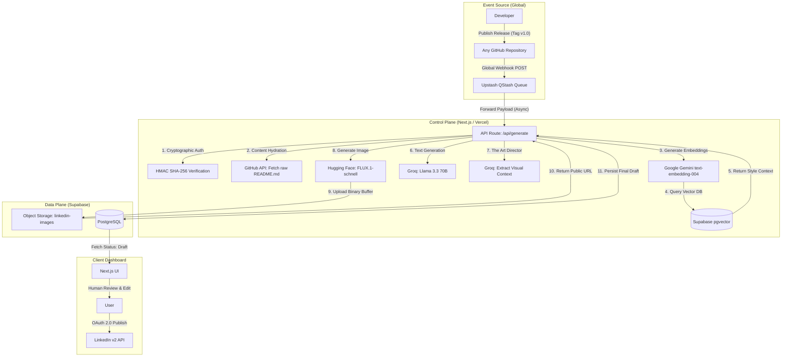

# Architecture & System Design: Automated LinkedIn Content Engine (V1)

## 1. High-Level Overview

The Commit-to-LinkedIn Engine is an event-driven, serverless microservice designed to automate the generation of technical developer content. It leverages Retrieval-Augmented Generation (RAG) to ensure stylistic consistency and uses a multi-modal AI approach (Text + Image) to create high-engagement posts directly from git commit metadata and codebase documentation.

**Core Architecture:**
To achieve true "Zero-Configuration" scaling across a developer's entire portfolio, the system utilizes a **Decoupled Event-Driven Architecture**. By utilizing Account-Level GitHub Webhooks and a Serverless Redis Message Queue (Upstash QStash), new repositories added to the GitHub account are automatically integrated into the AI pipeline without requiring localized CI/CD YAML configuration files. This decoupling safely bypasses strict serverless timeout limits, allowing complex AI inference to run asynchronously.

## 2. System Architecture Diagram

The system utilizes a **Push-Based Asynchronous Workflow**. The workflow separates the immediate event trigger from the heavy compute processing to safely navigate serverless execution limits.



## 3. Technology Stack & Rationale

| Component | Technology | Rationale |
| --- | --- | --- |
| **Compute / API** | Next.js (App Router) on Vercel | Provides serverless API routes (`/api/*`) and frontend UI in a single monorepo. Configured with `maxDuration: 60` for background processing. |
| **Message Queue** | Upstash QStash (Serverless Redis) | Acts as the critical asynchronous buffer. Intercepts the GitHub webhook, returns an instant `200 OK` to prevent client timeouts, and securely forwards the payload to the Vercel worker. |
| **Database** | Supabase (PostgreSQL) | Combines relational data tracking (users, post states) with `pgvector` for semantic search, eliminating the need for a separate vector database. |
| **LLM Inference** | Groq (Llama 3.3 70B) | Chosen for ultra-low latency inference. Acts in a dual capacity: first as the technical copywriter, and second as the "Art Director" translating abstract code into physical visual prompts. |
| **Embeddings** | Gemini text-embedding-004 | High-dimensional (768d) embeddings optimized for semantic retrieval of technical and stylistic content. |
| **Image Gen** | Hugging Face (FLUX.1-schnell) | State-of-the-art open-source image model utilized via Serverless Inference API for rapid, high-fidelity 3D technical renders. Replaces Google Imagen due to API constraints. |
| **Trigger Mechanism** | GitHub Global Webhooks | Enables "Zero-Configuration" scaling across the entire developer account. Eliminates the need for localized CI/CD YAML files per repository. |

## 4. The Serverless Timeout Dilemma (Why Redis?)

A core engineering challenge in this architecture is the incompatibility between GitHub's strict webhook delivery rules and Vercel's serverless lifecycle.

1. **The Client Constraint:** GitHub Webhooks require a `200 OK` response within **10 seconds**, otherwise the delivery is marked as a failure and the connection is dropped.
2. **The Compute Constraint:** The AI pipeline (RAG + Text Gen + Image Gen + Storage) requires **20-30 seconds** to execute.
3. **The Serverless Freeze Trap:** Standard Node.js Express servers can return a response and continue processing in the background. Vercel Serverless functions **freeze CPU execution** the exact millisecond a response is returned.

**The Solution:** An asynchronous decoupled queue using Upstash QStash. QStash intercepts the webhook, immediately satisfies GitHub's 10-second rule, and then acts as a persistent client, holding the connection to Vercel open for the full 60-second `maxDuration` window while the AI pipeline runs.

## 5. Data Architecture

### 5.1. Database Schema (PostgreSQL)

#### Table: `style_examples` (The Knowledge Base)

Used for RAG. Stores high-performing past posts to "teach" the LLM the user's voice.

```sql
CREATE TABLE style_examples (
  id UUID PRIMARY KEY DEFAULT gen_random_uuid(),
  content TEXT NOT NULL,
  embedding VECTOR(768) -- Gemini Embedding Dimensions
);
```

#### Table: `posts` (The State Machine)

Stores the lifecycle of a generated post, tracking its journey from an async job to a published entity.

```sql
CREATE TABLE posts (
  id UUID PRIMARY KEY DEFAULT gen_random_uuid(),
  repo_name TEXT NOT NULL,
  release_tag TEXT NOT NULL,
  
  -- AI Generated Assets
  draft_content TEXT,
  image_url TEXT,
  
  -- Workflow State
  status TEXT CHECK (status IN ('queued', 'draft', 'published', 'failed')) DEFAULT 'queued',
  
  -- Metadata
  created_at TIMESTAMPTZ DEFAULT NOW(),
  linkedin_post_id TEXT
);
```

### 5.2. Vector Search Implementation

* **Metric:** Cosine Distance (`<=>` operator in pgvector).
* **Threshold:** Strict distance filtering (`< 0.5`) to ensure stylistic alignment before appending context to the LLM prompt.

## 6. Pipeline Sequence (The "Generate" Flow)

1. **The Global Trigger:** A developer publishes a Release (e.g., `v1.0`) on any owned repository. GitHub fires an account-level webhook payload containing metadata (repo name, owner, tag).
2. **The Queue Intercept (QStash):** Upstash receives the webhook, replies `200 OK` to GitHub, and forwards the payload to `/api/generate`.
3. **Validation & Hydration:** * The Next.js API validates the HMAC SHA-256 signature.
* The API dynamically construc
   * The Next.js API validates the HMAC SHA-256 signature.
   * The API dynamically constructs the raw GitHub content URL (`https://raw.githubusercontent.com/{owner}/{repo}/{tag}/README.md`) and executes an HTTP `GET` to pull the documentation into memory.
4. **Semantic Retrieval (RAG):** The commit metadata is embedded and queries `style_examples` for the top 2 most semantically similar past posts.
5. **Inference & Art Direction:**
   * **Text:** Groq generates the post body using Llama 3.3 and the RAG context.
   * **Sequential Prompting:** A secondary Groq call (the "Art Director") translates abstract code concepts from the README into a concrete, physical 3D visual description (preventing AI hallucinations on abstract terms).
   * **Visual:** The physical description is passed to Hugging Face FLUX.1 to generate the image buffer.
6. **Persistence:**
   * The raw binary image is streamed to the Supabase `linkedin-images` bucket.
   


## 7. Security, Constraints & Failovers

* **Cryptographic Webhook Security:** The API endpoint rejects any payload that does not contain a valid `X-Hub-Signature-256`. The system uses Node's `crypto` module to hash the incoming payload with a shared secret to prevent malicious SSRF or spam attacks.
* **Storage Security:** Supabase Storage utilizes strict Row-Level Security (RLS) policies, allowing `INSERT` operations only via the authenticated API backend, while maintaining `SELECT` access for public viewing.
* **Cascading API Failovers:** If the Hugging Face API experiences downtime or `410 Gone` errors, the system catches the exception and falls back to Pollinations.ai, and ultimately to a static grayscale placeholder generator to ensure the database draft is never permanently blocked.
* **Dead Letter Queue (DLQ):** If the Vercel API is unreachable, QStash automatically retries the delivery. Persistent failures are routed to a DLQ for manual inspection and replay, ensuring zero data loss.

## 8. Future Roadmap (V2 Considerations)

- **Multi-Tenancy:** Implementing Row Level Security (RLS) to support multiple users

- **Analytics Feedback Loop:** Feeding LinkedIn engagement metrics back into the Vector DB to weight "successful" styles higher
- **Analytics Feedback Loop:** Feeding LinkedIn engagement metrics back into the Vector DB to weight "successful" styles higher